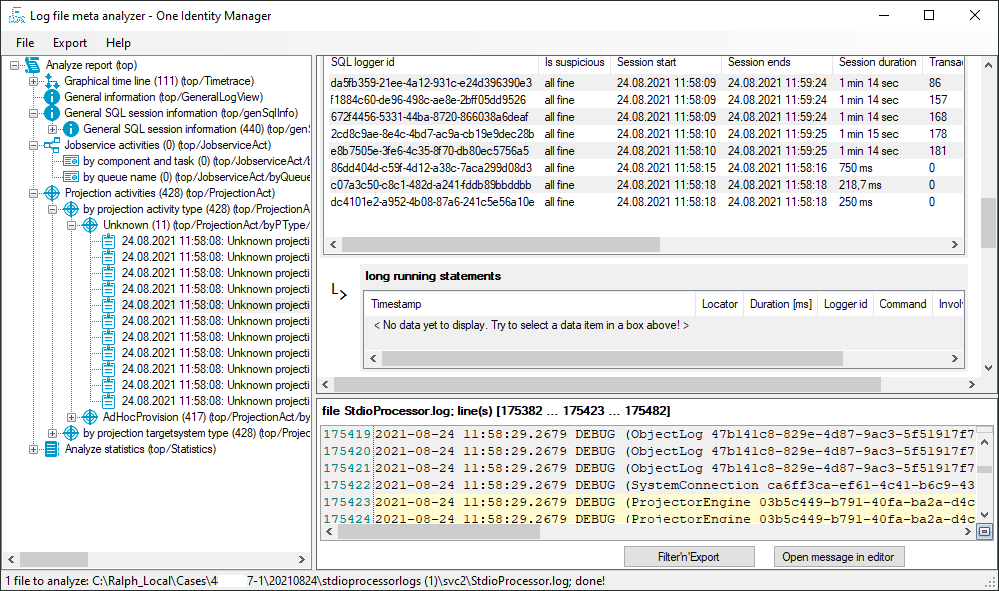

Logfile Analyser of One Identity text log files
================================================

Can read text files (a single one, a multi select or a file system folder) of following types:
- NLog with default OneIM config (e.g. StdIoprocessor.log)
- Jobservice.log produced by OneIM Jobservice service

What does it do?
----------------

- it will read the provided log files and try to detect their type 
- all lines were send into a buffer to unite all lines that belong a to message (which needs to start with a time stamp)
- those messages were passed into several parsers, each of them will subscribe to a specific topic
	- detecting time ranges of all logfiles to provide a time line for all of them 
	- detecting time gaps between messages, which references to possible stuck situations
	- detecting Jobservice process steps, each of them have a request and response which should be tied together, detect errors and warning results for process steps
	- detecting OneIM synchronization AdHoc and FullSync processes, including start and finish event, type and target system name to provide an overall activity
	- detecting OneIM synchronization information about involved Connectors and their activity 
	- detecting OneIM synchronization activity (e.g. loading data from a specific target system)
	- detecting OneIM synchronization journal reports
	- detecting database SQL commands and their duration, detecting SQL transactions and long running queries
- finally all gathered information were presented in an UI
- there is a possibility to filter the log files for certain messages, based on gathered IDs, message types and activity flows and threads

Components:
-----------

- user interface as client application
- log file text reader 
- parser for log messages
- detectors which analyze the messages
- storing information into an internal data store structure
- each detector has its own result presenting UI component to present its own results based on a specific topic
- message export functionality

