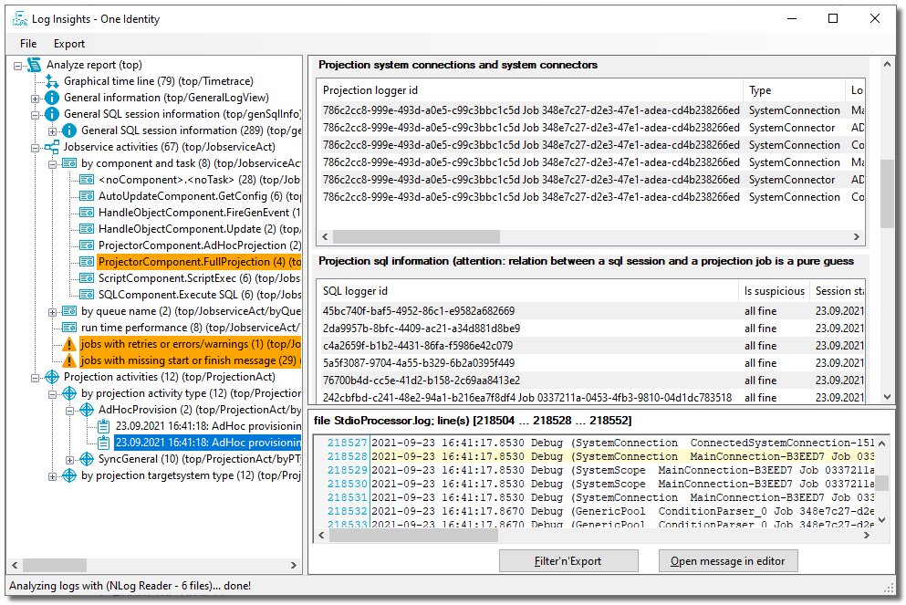

**One Identity open source projects are supported through [One Identity GitHub issues](https://github.com/OneIdentity/IdentityManager.LogInsights/issues) and the [One Identity Community](https://www.oneidentity.com/community/). This includes all scripts, plugins, SDKs, modules, code snippets or other solutions. For assistance with any One Identity GitHub project, please raise a new Issue on the [One Identity GitHub project](https://github.com/OneIdentity/IdentityManager.LogInsights/issues) page. You may also visit the [One Identity Community](https://www.oneidentity.com/community/) to ask questions.  Requests for assistance made through official One Identity Support will be referred back to GitHub and the One Identity Community forums where those requests can benefit all users.**

# Log Insights for One Identity Manager logs

[](https://github.com/OneIdentity/IdentityManager.LogInsights/actions/workflows/ci.yml)
[](https://github.com/OneIdentity/IdentityManager.LogInsights/releases/)


_Provide insights over the contents of One Identity Manager log files or log entries in Azure Application Insights._




<!-- TABLE OF CONTENTS -->
<details open="open">
  <summary><h2 style="display: inline-block">Table of Contents</h2></summary>
  <ol>
    <li>
      <a href="#about-the-project">About the project</a>
    <li>
      <a href="#getting-started">Getting started</a>
      <ul>
        <li><a href="#prerequisites">Prerequisites</a></li>
        <li><a href="#building">Building</a></li>
        <li><a href="#installation">Installation</a></li>
      </ul>
    </li>
    <li><a href="#usage">Usage</a></li>
    <li><a href="#contributing">Contributing</a></li>
    <li><a href="#license">License</a></li>
  </ol>
</details>

<!-- ABOUT THE PROJECT -->
## About the project

Identity Manager log files or the equivalent entries in Azure AppInsights overwhelm the administrator with a "wall of text" where insights over the system behaviour are hidden. Goal of this tool is to provide an analysis frontend to get these insights without needing to know a query language or deeper knowledge over the internals of Identity Manager.

It supports log files in the standard logging format written by NLog, Jobservice log files, and logs pushed to Azure Application Insights over the NLog logger.


<!-- GETTING STARTED -->
## Getting started

To get a local copy up and running follow these simple steps.

### Prerequisites

Download the [.NET 5 SDK](https://dotnet.microsoft.com/download).

### Building

1. Clone the repo
   ```powershell
   git clone https://github.com/OneIdentity/IdentityManager.LogInsights.git
   cd IdentityManager.LogInsights
   ```
2. Build the project
   ```powershell
   dotnet build
   ```
3. Run the program
   ```powershell
    dotnet run --project LogInsights\LogInsights.csproj
   ```

Or open it in Visual Studio and run it from there.

### Installation

Download a ZIP file from the [Releases](https://github.com/OneIdentity/IdentityManager.LogInsights/releases/)
page, unzip it into a folder and run `LogInsights.exe`.

The program runs on all Windows versions supported by .NET 5.

<!-- USAGE EXAMPLES -->
## Usage

Drag and drop log files or folders onto the tree on the left side or open logs from the `File -> Load logs...` dialog.

The frontend supports the following analyses:

- detect time ranges of all logfiles to provide a time line for all of them
- detect time gaps between messages, which shows possible deadlock situations
- detect JobService process steps, their requests and responses which should be tied together, detect errors and warning results for process steps
- detect One Identity Manager synchronization ad hoc and full sync processes, including start and finish events, types and target system names to provide an overview over overall activity
- detect One Identity Manager synchronization information about involved connectors and their activity
- detect One Identity Manager synchronization activity (e.g. loading of data from a specific target system)
- detect One Identity Manager synchronization journal reports
- detect database SQL commands and their duration, detecting SQL transactions and long running queries

Many of these analyses depend of deeper log levels, like `Debug` or on the `Debug` mode of the JobService.

<!-- _For more examples, please refer to the [Documentation](https://example.com)_ -->


<!-- CONTRIBUTING -->
## Contributing

Contributions are what make the open source community such an amazing place to be learn, inspire, and create. Any contributions you make are **greatly appreciated**.

1. Fork the Project
2. Create your Feature Branch (`git checkout -b feature/AmazingFeature`)
3. Commit your Changes (`git commit -m 'Add some AmazingFeature'`)
4. Push to the Branch (`git push origin feature/AmazingFeature`)
5. Open a Pull Request


<!-- LICENSE -->
## License

Distributed under the One Identity - Open Source License. See [LICENSE](LICENSE) for more information.

